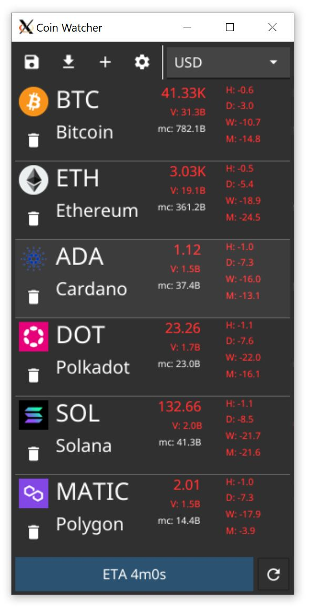

# CoinWatcher
A simple GUI to track cryptocurrency prices.


# How to run it

```
$ go install github.com/itohi/CoinWatcher/cmd/watcher@latest
```

All the requirements for building Fyne apps apply.

## Configuration

You will need Coinmarketcap API key for this to work. They offer a free tier with 
10000 API credits per month, so it should be plenty enough for casual use.

You can setup the API key using `COINWATCHER_KEY` environment variable at first start. Otherwise it is possible
to configure the api key using settings button.

# Features

- [x] Save/Load coin list
- [x] Fetch prices from Coinmarketgo
-    [x] Cache coin images
-    [ ] Convert currency (requires either payed plan or fetching fiat currencies and converting that way)
-    [ ] Disable certain controls when Coinmarketcap is not available(incorrect API key)
-    [ ] Display better errors when failed to fetch data from Coinmarketcap
-    [ ] Recreate crypto feed variable after API key change
-    [ ] Handle symbols with non alpha-numeric characters correctly
- [ ] Fetch and display coin hisstoric data
- [x] Autoupdate coin prices
- [ ] Add other sources
- [ ] Better coin entry (e.g. use autocomplete)
- [ ] Better coin matching logic (currently matches by symbol)
- [ ] Setup actions for when a price reaches certain threshold
-    [ ] pluggable pattern matchers
-    [ ] pluggable actions
